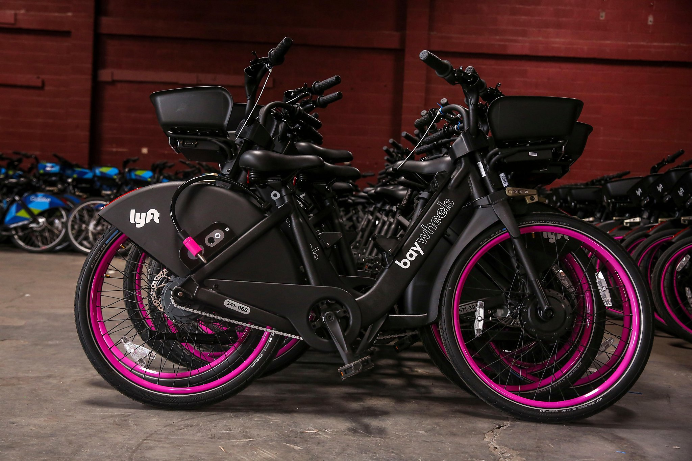
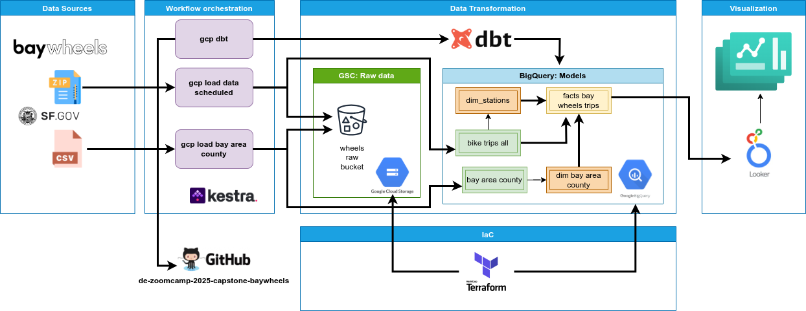
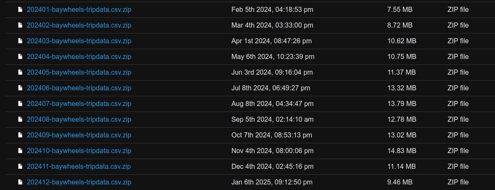

# de-zoomcamp-2025-capstone-baywheels

## Introduction

Bay Wheels is a regional public bicycle sharing system in California's San Francisco Bay Area. It is operated by Motivate in a partnership with the Metropolitan Transportation Commission and the Bay Area Air Quality Management District. Bay Wheels is the first regional and large-scale bicycle sharing system deployed in California and on the West Coast of the United States. It was established as Bay Area

### Objectives

### Overview

## Technologies

State-of-the-art software tools were used to carry out this project. These tools are briefly described below.

* **Data lake - [Google Cloud Storage (GCS)](https://cloud.google.com/storage?hl=en)**: GCS is a cloud storage service offered by Google Cloud Platform (GCP) that allows you to store and access large amounts of unstructured data, such as files, images, videos, and backups. It offers high availability, security, and scalability, with storage classes (Standard, Nearline, Coldline, and Archive) to suit different use cases and cost needs. GSC is used to store the raw data, this will allow us to easily access and analyze the data using other tools such as BigQuery.
* **Infrastructure as Code (IaC) - [Terraform](https://developer.hashicorp.com/terraform)**: Terraform is an infrastructure-as-code (IaC) tool that allows you to create, manage, and provision cloud resources using configuration files. Terraform is used to automate the deployment of GCP resources, ensuring that our infrastructure is reproducible and scalable.
* **Workflow orchestration - [Kestra](https://kestra.io/)**: Kestra is an open-source workflow orchestration platform designed to manage and automate complex data processes. It enables you to create, execute, and monitor data pipelines, integrates with multiple systems and services, and offers a highly scalable and flexible approach, ideal for big data and advanced analytics environments. Kestra is used to manage workflows, schedule jobs, and monitor the performance of our pipelines.
* **Data transformation - [dbt](https://www.getdbt.com/)**: DBT (Data Build Tool) is an open-source tool that facilitates data transformation in a modern data environment, such as a data warehouse. It enables data analysts to write, test, and document data transformations using SQL in a simple and structured manner. DBT automates the data model creation process and performs tasks such as data cleansing, transformation, and aggregation, ensuring high-quality and reproducible results. DBT is used to create models to analyze raw data from Bay wheels.
* **Data warehouse - [BigQuery](https://cloud.google.com/bigquery?hl=en)**: BigQuery es un servicio de almacenamiento y análisis de datos en la nube de Google Cloud Platform (GCP) que permite realizar consultas SQL rápidas y escalables sobre grandes volúmenes de datos. Está diseñado para manejar petabytes de datos de manera eficiente, aprovechando la infraestructura de Google para ofrecer análisis en tiempo real. BigQuery es completamente gestionado, lo que significa que no necesitas preocuparte por la infraestructura subyacente, y es ideal para análisis de datos masivos, informes, y procesamiento de datos en tiempo real. BigQuery is used to store the processed data resulting from the transformations performed by DBT. The tables with processed data are used to create dashboards.
* **Dashboard - [Looker Studio](https://lookerstudio.google.com/u/0/navigation/reporting)**: Looker is a data analytics and business intelligence platform that allows you to explore, visualize, and share insights interactively using the LookML modeling language. It integrates with cloud databases and facilitates the creation of real-time collaborative dashboards, reports, and ad-hoc analyses. Looker Studio is used to create a dashboard that visualizes the knowledge extracted from the datasets. These visualizations allow you to answer questions related to Bay Wheels bikes.

## Data Pipeline
To carry out this project, a batch pipeline was developed with the following components:
- **Infrastructure as Code**. *Terraform* is used to create the GSC bucket and the dataset in BigQuery.
- **Sources**:
    * **Bay Wheels**. Zip files of bike trips.
    * **Sf.gov**. CSV file with Bay Area counties.
- **Raw Data**. GSC bucket (Bay Wheels raw bucket) to store CSV data on bike trips and Bay Area counties.
- **Workflow**. The *Kestra* orchestrator is used to perform the workflow with the following flows:
    * **gcp load data scheduled**. Load monthly data from Bay Wheels bikes to the GSC bucket.
    * **gcp bay area**. Load data from Bay Area counties to the GSC bucket.
    * **gcp dbt**. Perform data transformations and load them into the BigQuery dataset.
- **Data Transformation**. The transformations are performed using *dbt*.
    * **stg bawheels trips**. View of bike trips.
    * **dim bay area county**. Dimension table with counties.
    * **dim statation**. Dimension table with stations.
    * **facts baywheels trips**. Fact table with the analysis of bike trip data.
- **Visualization**. Three dashboards are created using Locker Studio.

The general pipeline diagram is shown below.

## Dataset
Bay Wheels is a regional bike share program serving Oakland, San Jose, and San Francisco. Bay Wheels offers 7,000+ bicycles (both traditional bikes and hybrid electric bikes) available for pickup at over 500 stations. The Bay Wheels dataset contains information about individual rides made in the bike-sharing system around the San Francisco Bay Area. 

Bay Wheels ride data is anonymized and available for public use under the Bay Wheels License Agreement at https://www.lyft.com/bikes/bay-wheels/system-data. 

The datasets can be viewed at the [Download Bay Wheels trip history data](https://s3.amazonaws.com/baywheels-data/index.html). When we open the link above, we see that there is a dataset of bike trips from 2018 to 2025. However, a format change was made starting in mid-2020. For this reason, this project will only use bike trip datasets after June 2020, which have the new trip format.

Each monthly dataset is composed of the following fields:

* **ride_id**. Ride Identifier.
* **rideable_type**. Ride Type. This field is of categorical type and has the following values: *classic_bike*, *electric_bike* or *electric_escooter*.
* **started_at**. The started date and time.
* **ended_at**. The end date and time.
* **start_station_name**. Start Station Name.
* **start_station_id**. Start Station identifier.
* **end_station_name**. End Station Name.
* **end_station_id**. End Station identifier.
* **start_lat**. Start Station Latitude.
* **start_lng**. Start Station Longitude.
* **end_lat**. End Station Latitude.
* **end_lng**. End Station Longitude.
* **member_casual**. User Type. This field is of categorical type and has the following values: *Member* or *Casual*.

Stations

* **City**. 
* **Station ID**. 
* **Station Name**. 
* **Number of Docks**. 
* **On/Off-Street**. 
* **EPC Status**. 
* **Transit Status**. 
* **Latitude**. 
* **Longitude**. 

Within the historical dataset of Lyft Bay Wheels riders, there may be trips whose location coordinates (latitude and longitude) are incorrect and are displayed outside the Bay Area. This can skew trip analysis, for example, when calculating trip times or distances. For this reason, we need a dataset with a geometric area for Bay Area districts to rule out trips whose locations do not appear within these locations. The San Francisco government has the dataset with limitations for [Bay Area counties](https://data.sfgov.org/Geographic-Locations-and-Boundaries/Bay-Area-County-Polygons/wamw-vt4s/about_data). This dataset is composed of the following fields:

* **the_geom**. Geometric figure of the county area
* **OBJECTID**. Unique identifier.
* **FIPSSTCO**. The Federal Information Processing Standard Publication.
* **COUNTY**. County name.

## GCP Setting up

This project builds its infrastructure on the cloud provider GCP (Google Cloud Platform). For this reason, you must first set up your account, create a project, and configure the corresponding permissions. See the [GCP Setting up](gcp_overview.md) document for a detailed description of the steps to follow for proper use.

## Infrastructure as Code

This project creates its infrastructure on the cloud provider GCP using the Terraform tool. For this reason, you must install the Terraform client, configure GCP access credentials, and create the resources used in the project on GCP. See the [Terraform Configuration](terraform/README.md) document for a detailed description of the steps to follow for proper use.

## Data Ingestion Workflow

This project uses the Kestra workflow orchestrator to create an ETL pipeline for the Bay Wheels bike dataset. For this purpose, you must start Kestra's Docker-Compose, configure GCP access credentials, run flows to load data from sources into the GCP bucket and Bigquery data warehouse; and execute data transformations to store the data in the Bigquery data warehouse. See the [Kestra Configuration](kestra/README.md) document for a detailed description of the steps to follow for proper use.

## Data Transformation

## Dashboard

https://lookerstudio.google.com/reporting/55eb6c32-4723-4f15-970e-5c0886c13704

