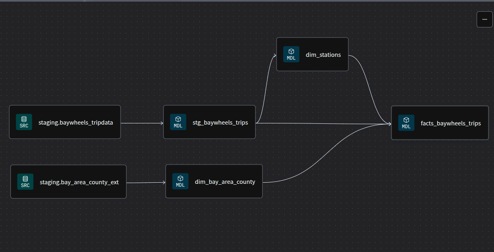

# dbt Project.

## Raw Tables

### Table: bay_area_county_ext 
The data from the San Francisco Bay Area counties dataset is loaded into the external table bay_area_county_ext. This table has the following fields:

* **geometry**. String with Geometric figure that delimits the area of ​​a county in the San Francisco Bay Area.
* **county_id**. Unique identifier.
* **fipsstco**. The Federal Information Processing Standard Publication.
* **county_name**. County name.

### Table: baywheels_tripdata
Bay Wheels bike trip data is loaded into the "baywheels_tripdata" table. This table has the following fields:

* **unique_row_id**. A unique identifier for the trip, generated by hashing key trip attributes.
* **filename**. The source filename from which the trip data was loaded.
* **ride_id**. Ride Identifier.
* **rideable_type**. Ride Type. This field is of categorical type and has the following values: *classic_bike*, *electric_bike* or *electric_escooter*.
* **started_at**. The started date and time.
* **ended_at**. The end date and time.
* **start_station_name**. Start Station Name.
* **start_station_id**. Start Station identifier.
* **end_station_name**. End Station Name.
* **end_station_id**. End Station identifier.
* **start_lat**. Start Station Latitude.
* **start_lng**. Start Station Longitude.
* **end_lat**. End Station Latitude.
* **end_lng**. End Station Longitude.
* **member_casual**. User Type. This field is of categorical type and has the following values: *Member* or *Casual*.

## Dimension tables

### Table: dim_stations

* **station_id**. Station id.
* **station_name**. Station Name.
* **location**. Coordinates with the longitude and latitude of the station.
* **updated_at**. Update date.

### Table: dim_bay_area_county

The dimension table "dim_bay_area_county" is created from the raw table "bay_area_county_ext." To create the table, the "geometry" column is transformed from a string to a multipolygon, and the update date is added.

* **county_id**. Unique identifier.
* **county_name**. County name.
* **fipsstco**. The Federal Information Processing Standard Publication.
* **geometry**. Multipolygon that delimits the area of ​​a county in the San Francisco Bay Area.
* **updated_at**. Update date.

