# Kestra Project

## Overview

Within the project we have the following file structure:


```plaintext
├── flows/
│   ├── 01_gcp_kv.yaml                       # Creating KV for GCP.
│   ├── 02_gcp_load_bay_area_county.yaml     # Load the Bay Area counties dataset.
│   ├── 05_gcp_load_data_scheduled.yaml      # Load the monthly scheduled dataset of Bay Area bikes
│   ├── 06_gcp_dbt.yaml                      # Data transformation
├── docker-compose.yml                       # Docker-compose para kestra.
```

* [01_gcp_kv.yaml](flows/01_gcp_kv.yaml). This flow creates entries in the KS store with the variables needed to access the GCP cloud provider.
* [02_gcp_load_bay_area_county.yaml](flows/02_gcp_load_bay_area_county.yaml). This flow loads the Bay Area counties dataset into the GSC bucket and a final BigQuery table.
* [05_gcp_load_data_scheduled.yaml ](flows/05_gcp_load_data_scheduled.yaml). This flow loads the Bay Wheels bike dataset partitioned by year and month. The data is extracted from a zip file, the CSV dataset is loaded into a GSC bucket, the CSV dataset is loaded from GSC into a monthly BigQuery table, and finally the data is merged into the final destination BigQuery table. This flow performs monthly schedule.
* [06_gcp_dbt.yaml ](flows/06_gcp_dbt.yaml ). This workflow defines the transformations that are performed by dbt.
* [docker-compose.yml](docker-compose.yml). This docker-compose file contains the Docker configuration required for the Kestra workflow to function properly.


## GCP Setting Up

This project creates the infrastructure in GCP because you must first configure your account, create a project, and set up the corresponding permissions. See the [GCP Setting up](../gcp_overview.md#initial-setup) document.


## Setup Kestra

We'll set up Kestra using Docker Compose containing one container for the Kestra server and another for the Postgres database:

```bash
cd kestra/
docker compose up -d
```

Once the container starts, you can access the Kestra UI at [http://localhost:8080](http://localhost:8080).

## Add Flows

Adding flows to Kestra can be done in two ways: manually and programmatically. It is advisable to use the programmatic method since it is less tedious. Each method is described below.

### Programmatically

If you prefer to add flows programmatically using Kestra's API, run the following commands:

First, . We create an entry in the Kestra "KV Store" with the GCP access credentials using the following command:

```bash
curl -X PUT -H "Content-Type: application/json" http://localhost:8080/api/v1/namespaces/bay-wheels/kv/GCP_CREDS -d "@../gcp-credentials.json"
```
El fichero "gcp-credentials.json" contiene las credenciales de acceso GCP que se obtuvo durante la configuración de acceso a GCP.

Secondly, we add each of the flows (YAML files) that are inside the [flows](flows) directory using the following commands:

```bash
curl -X POST http://localhost:8080/api/v1/flows/import -F fileUpload=@flows/01_gcp_kv.yaml
curl -X POST http://localhost:8080/api/v1/flows/import -F fileUpload=@flows/02_gcp_load_bay_area_county.yaml
curl -X POST http://localhost:8080/api/v1/flows/import -F fileUpload=@flows/05_gcp_load_data_scheduled.yaml
curl -X POST http://localhost:8080/api/v1/flows/import -F fileUpload=@flows/06_gcp_dbt.yaml
```

Once the flows have been added to Kestra, they can be viewed in the "flows" section of the console as shown in the following figure.

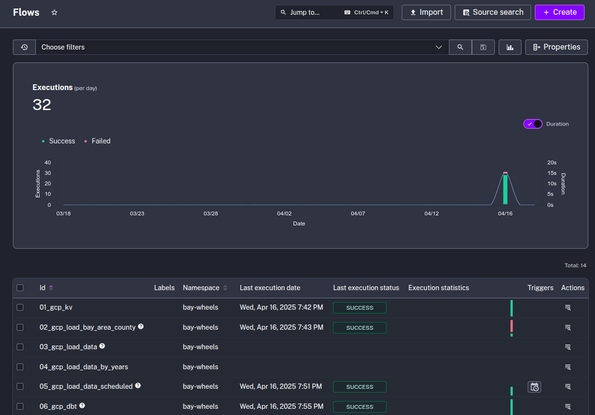

### Manually

Another option for adding flows to Kestra is to do so manually. To do this, open the console in a browser. Within the console, go to "flows" and click the "import" button. We import each of the flows (YAML files) found in the [flows](flows) directory.

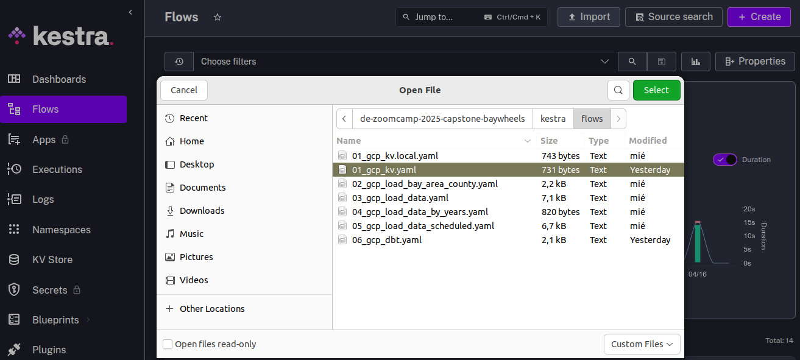

To add GCP credentials, it is best to add them via the KV option in the console.

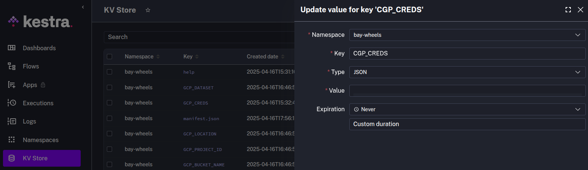

## GCP Workflow: Setup Google Cloud Platform

Before we start loading data to GCP, we need to set up the Google Cloud Platform. 

First, adjust the following flow [`01_gcp_kv.yaml`](flows/01_gcp_kv.yaml) to include your service account, GCP project ID, BigQuery dataset and GCS bucket name (_along with their location_) as KV Store values:
- GCP_PROJECT_ID.
- GCP_LOCATION.
- GCP_BUCKET_NAME.
- GCP_DATASET.

Once the values ​​are configured correctly, we execute the flow to create the entries in the KV Store.

Because the [`01_gcp_kv.yaml`](flows/01_gcp_kv.yaml) import gives problems when setting the GCP_CREDS entry containing a JSON document, the *GCP_CREDS* KV entry is made separately either manually or programmatically as explained above.

> [!WARNING]  
> The `GCP_CREDS` service account contains sensitive information. Ensure you keep it secure and do not commit it to Git. Keep it as secure as your passwords.

KV Store entries can be viewed in the Kestra console under the KV Store section.

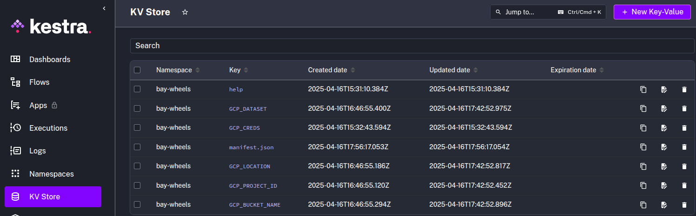


## GCP Workflow: Load Bay Area Counties to BigQuery

This flow aims to load the Bay Area counties dataset into a BigQuery table. The steps in this flow are as follows:
1. Download the Bay Area counties dataset in CSV format.
2. The downloaded dataset is uploaded to the GCS bucket.
3. Load the dataset from the GCS bucket to an external table, "bay_area_county_ext."
4. Purge the downloaded files in the flow.

Below is the flow diagram in kestra.

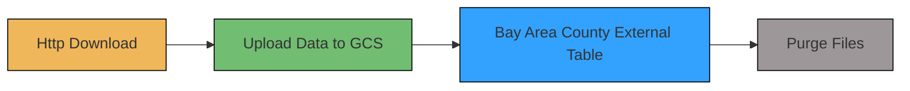
The flow code: [`02_gcp_load_bay_area_county.yaml`](flows/02_gcp_load_bay_area_county.yaml).

Once we execute the flow in the Kestra console, its execution result should be displayed as shown in the following figure.

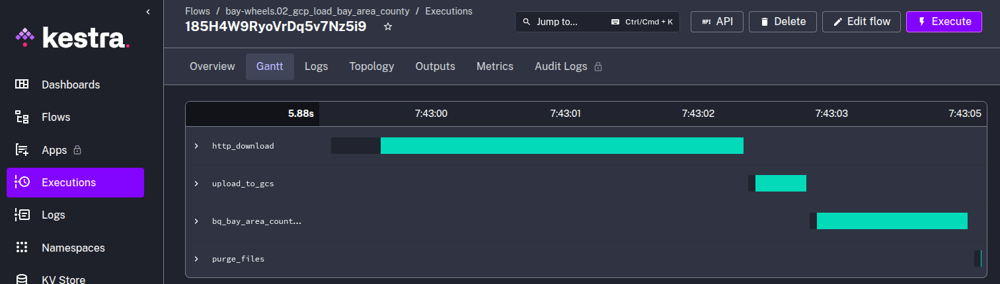

Additionally, the result of the flow execution will add the dataset "bay_area_county_polygons.csv" to the GCS bucket and the external table "bay_area_county_ext" will be created in BigQuery as shown in the following images.

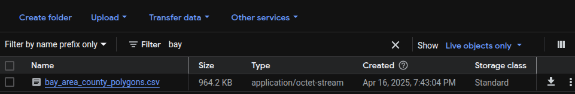

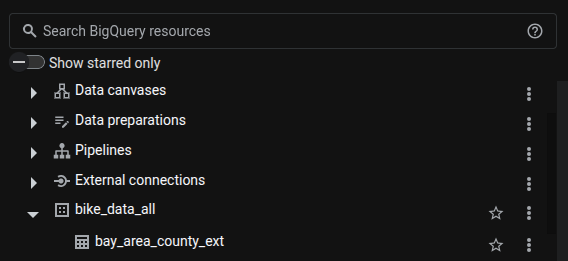

## GCP Workflow: Load Bay Wheels to BigQuery

This flow aims to load the Bay Wheels bike trip dataset into a BigQuery table. The steps in this flow are as follows:

* Extract the Bay Wheels CSV dataset partitioned by year and month. The dataset has the following format: "YYYYmm-baywheels-tripdata.csv"
* Load the downloaded CSV dataset into the GCS bucket.
* Load the dataset from the GCS bucket into a monthly external table. The table has the following format: "baywheels_tripdata_YYYY_mm"
* Merge the data into the final destination table "baywheels_tripdata".
* Purge the downloaded files in the flow.

```mermaid
graph LR
  SetLabel[Set Labels]:::label --> Extract[Extract CSV Data]:::unzip
  Extract     --> UploadToGCS[Upload Data to GCS]:::gsc
  UploadToGCS --> BQTripdata[Main Tripdata Table]:::bq
  BQTripdata  --> BQTableExt[External Table]:::bq
  BQTableExt  --> BQTableTmp[Monthly Table]:::bq  
  BQTableTmp  --> BQMerge[Merge to Main Table]:::bq
  BQMerge     --> PurgeFiles[Purge Files]:::purge

classDef label fill:#a0abea,stroke:#000,stroke-width:1px;
classDef unzip fill:#e081aa,stroke:#000,stroke-width:1px;
classDef bq fill:#33a2ff,stroke:#000,stroke-width:1px;
classDef gsc fill:#71bd72,stroke:#000,stroke-width:1px;
classDef purge fill:#9e979a,stroke:#000,stroke-width:1px;
```

The monthly scheduled execution by trigger of this flow is described below.

### GCP Workflow: Schedule and Backfill Full Dataset

This option corresponds to the [05_gcp_load_data_scheduled](flows/05_gcp_load_data_scheduled.yaml). We can now schedule the same pipeline shown above to run monthly for the bay wheels dataset. You can backfill historical data directly from the Kestra UI.

Since we now process data in a cloud environment with infinitely scalable storage and compute, we can backfill the entire dataset for bay wheels dataset without the risk of running out of resources on our local machine.

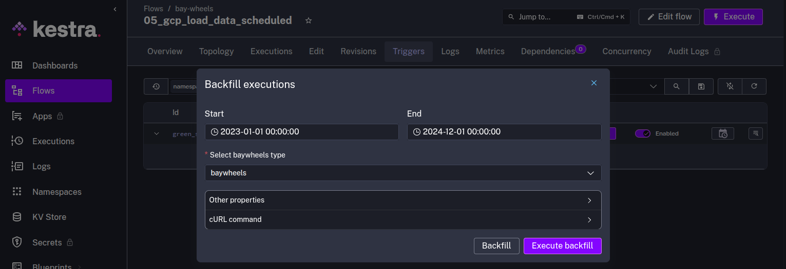

The flow code: [`06_gcp_taxi_scheduled.yaml`](flows/06_gcp_taxi_scheduled.yaml).


The result of the flow execution will add the dataset "YYYYmm-baywheels-tripdata.csv" to the GCS bucket and the external table "baywheels_tripdata_YYYY_mm" and the final destination table "baywheels_tripdata" will be created in BigQuery as shown in the following images.

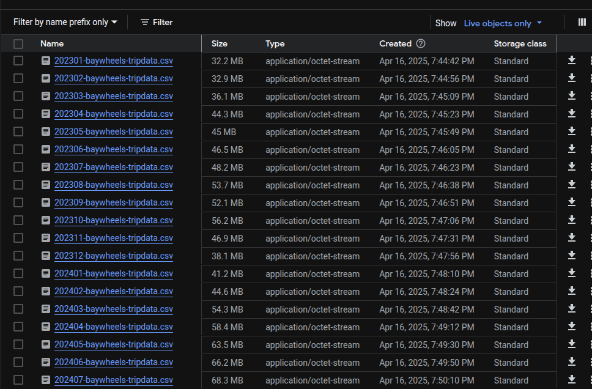

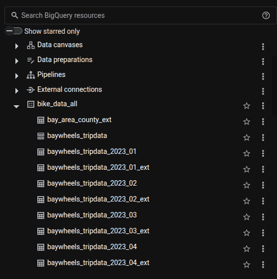


## GCP Workflow: Orchestrate dbt Models

Now that we have raw data ingested into BigQuery, we can use dbt to transform that data. The flow will sync the dbt models from Git to Kestra and run the `dbt build` command to build the models:

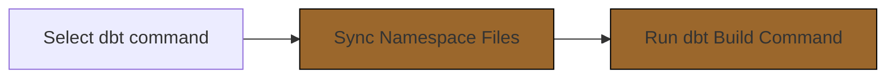

The flow code: [`06_gcp_dbt.yaml`](flows/06_gcp_dbt.yaml).

In the Kestra console, within the "bay-wheels" namespace, we search for the flow "06_gcp_dbt" and execute the flow.


The result of running the above flow can be seen in the kendra executions section.


A more detailed description of the transformations can be seen in [dbt bay wheels](../dbt/bay_wheels/README.md).

