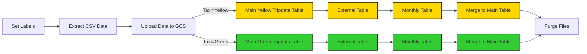

## Project

Within the project we have the following file structure:


```plaintext
├── flows/
│   ├── 01_gcp_kv.yaml                       # Defines infrastructure resources.
│   ├── 02_gcp_load_bay_area_county.yaml     # Configure infrastructure providers.
│   ├── 03_gcp_load_data.yaml                # Defines the outputs that Terraform will display when applying changes.
│   ├── 04_gcp_load_data_by_years.yaml       # Declare the variables that will be used in the 
│   ├── 05_gcp_dbt.yaml                      # Defines infrastructure resources.
├── docker-compose.yml                       # Configure infrastructure providers.
```

* [01_gcp_kv.yaml](flow/01_gcp_kv.yaml). This is the main file where you define the infrastructure resources you want to manage with Terraform. This is where you declare instances, buckets, datasets, tables, etc..
* [02_gcp_load_bay_area_county.yaml](flow/02_gcp_load_bay_area_county.yaml). Defines the providers that Terraform will use to manage the infrastructure, in our case the cloud provider GCP.
* [03_gcp_load_data.yaml](flow/03_gcp_load_data.yaml). This file is used to define the outputs that Terraform will display after applying changes to the infrastructure. Outputs are useful when you want to get information about resources you've created, such as IP addresses, instance IDs, etc.
* [04_gcp_load_data_by_years.yaml](flow/04_gcp_load_data_by_years.yaml). En este archivo defines las variables que puedes utilizar en tu configuración de Terraform.
* [04_gcp_load_data_by_years.yaml](flow/04_gcp_load_data_by_years.yaml). En este archivo defines las variables que puedes utilizar en tu configuración de Terraform.

### Setup Kestra

We'll set up Kestra using Docker Compose containing one container for the Kestra server and another for the Postgres database:

```bash
cd kestra/
docker compose up -d
```

Once the container starts, you can access the Kestra UI at [http://localhost:8080](http://localhost:8080).

If you prefer to add flows programmatically using Kestra's API, run the following commands:

```bash
curl -X PUT -H "Content-Type: application/json" http://localhost:8080/api/v1/namespaces/bay-wheels/kv/GCP_CREDS -d "@../de-zoomcamp-bay-wheels-a32c8429a9fd.json"
```

```bash
curl -X POST http://localhost:8080/api/v1/flows/import -F fileUpload=@flows/01_gcp_kv.yaml
curl -X POST http://localhost:8080/api/v1/flows/import -F fileUpload=@flows/02_gcp_load_bay_area_county.yaml
curl -X POST http://localhost:8080/api/v1/flows/import -F fileUpload=@flows/03_gcp_load_data.yaml
curl -X POST http://localhost:8080/api/v1/flows/import -F fileUpload=@flows/04_gcp_load_data_by_years.yaml
curl -X POST http://localhost:8080/api/v1/flows/import -F fileUpload=@flows/05_gcp_load_data_scheduled.yaml
curl -X POST http://localhost:8080/api/v1/flows/import -F fileUpload=@flows/06_gcp_dbt.yaml
```
### Setup Google Cloud Platform (GCP)

Before we start loading data to GCP, we need to set up the Google Cloud Platform. 

First, adjust the following flow [`01_gcp_kv.yaml`](flows/01_gcp_kv.yaml) to include your service account, GCP project ID, BigQuery dataset and GCS bucket name (_along with their location_) as KV Store values:
- GCP_CREDS
- GCP_PROJECT_ID
- GCP_LOCATION
- GCP_BUCKET_NAME
- GCP_DATASET.


> [!WARNING]  
> The `GCP_CREDS` service account contains sensitive information. Ensure you keep it secure and do not commit it to Git. Keep it as secure as your passwords.

### GCP Workflow: Load Taxi Data to BigQuery


### GCP Workflow: Load Taxi Data to BigQuery

