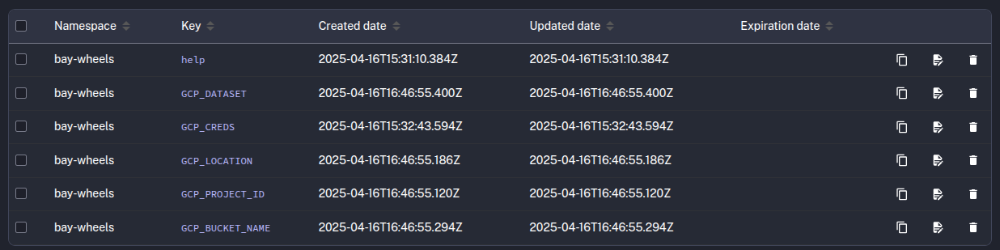
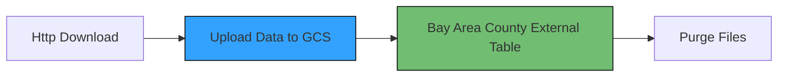
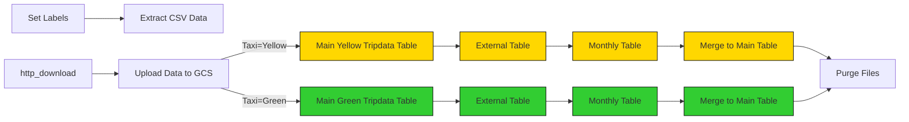
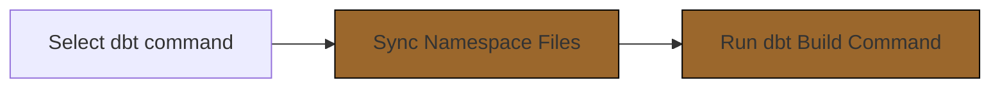
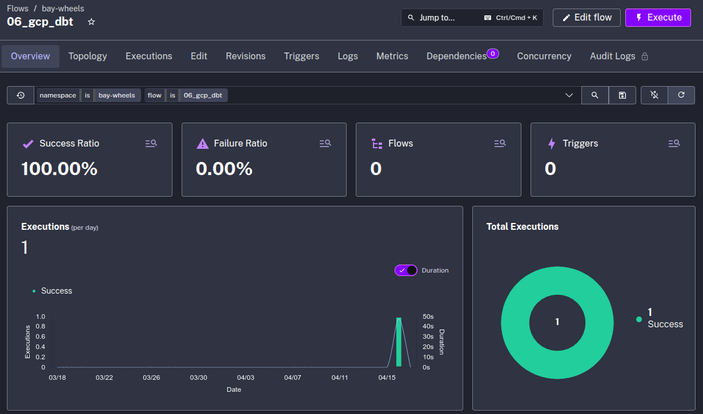
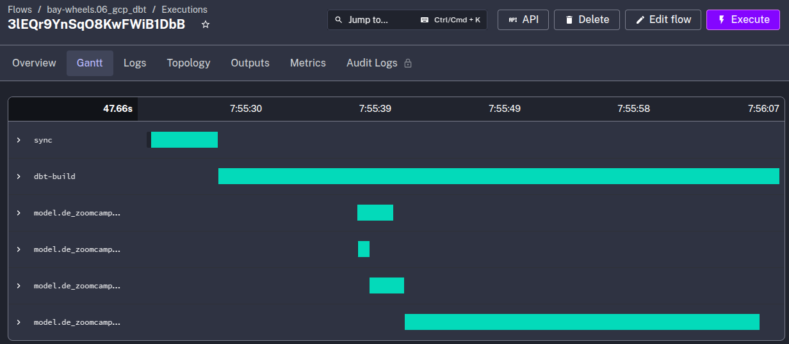

## Project

Within the project we have the following file structure:


```plaintext
├── flows/
│   ├── 01_gcp_kv.yaml                       # Creating KV for GCP.
│   ├── 02_gcp_load_bay_area_county.yaml     # Load the Bay Area counties dataset.
│   ├── 03_gcp_load_data.yaml                # Load the Bay Area bike dataset.
│   ├── 04_gcp_load_data_by_years.yaml       # Load the Bay Area bike dataset by years. 
│   ├── 05_gcp_load_data_scheduled.yaml      # Load the monthly scheduled dataset of Bay Area bikes
│   ├── 06_gcp_dbt.yaml                      # Data transformation
├── docker-compose.yml                       # Docker-compose para kestra.
```

* [01_gcp_kv.yaml](flows/01_gcp_kv.yaml). This is the main file where you define the infrastructure resources you want to manage with Terraform. This is where you declare instances, buckets, datasets, tables, etc..
* [02_gcp_load_bay_area_county.yaml](flows/02_gcp_load_bay_area_county.yaml). Defines the providers that Terraform will use to manage the infrastructure, in our case the cloud provider GCP.
* [03_gcp_load_data.yaml](flows/03_gcp_load_data.yaml). This file is used to define the outputs that Terraform will display after applying changes to the infrastructure. Outputs are useful when you want to get information about resources you've created, such as IP addresses, instance IDs, etc.
* [04_gcp_load_data_by_years.yaml](flows/04_gcp_load_data_by_years.yaml). En este archivo defines las variables que puedes utilizar en tu configuración de Terraform.
* [05_gcp_load_data_scheduled.yaml ](flows/05_gcp_load_data_scheduled.yaml ). En este archivo defines las variables que puedes utilizar en tu configuración de Terraform.
* [06_gcp_dbt.yaml ](flows/06_gcp_dbt.yaml ). This workflow defines the transformations that are performed by dbt.
. [docker-compose.yml](docker-compose.yml)

### Setup Kestra

We'll set up Kestra using Docker Compose containing one container for the Kestra server and another for the Postgres database:

```bash
cd kestra/
docker compose up -d
```

Once the container starts, you can access the Kestra UI at [http://localhost:8080](http://localhost:8080).


### Add flows by API

If you prefer to add flows programmatically using Kestra's API, run the following commands:

```bash
curl -X PUT -H "Content-Type: application/json" http://localhost:8080/api/v1/namespaces/bay-wheels/kv/GCP_CREDS -d "@../gcp-credentials.json"
```

```bash
curl -X POST http://localhost:8080/api/v1/flows/import -F fileUpload=@flows/01_gcp_kv.yaml
curl -X POST http://localhost:8080/api/v1/flows/import -F fileUpload=@flows/02_gcp_load_bay_area_county.yaml
curl -X POST http://localhost:8080/api/v1/flows/import -F fileUpload=@flows/03_gcp_load_data.yaml
curl -X POST http://localhost:8080/api/v1/flows/import -F fileUpload=@flows/04_gcp_load_data_by_years.yaml
curl -X POST http://localhost:8080/api/v1/flows/import -F fileUpload=@flows/05_gcp_load_data_scheduled.yaml
curl -X POST http://localhost:8080/api/v1/flows/import -F fileUpload=@flows/06_gcp_dbt.yaml
```
### GCP Workflow: Setup Google Cloud Platform

Before we start loading data to GCP, we need to set up the Google Cloud Platform. 

First, adjust the following flow [`01_gcp_kv.yaml`](flows/01_gcp_kv.yaml) to include your service account, GCP project ID, BigQuery dataset and GCS bucket name (_along with their location_) as KV Store values:
- GCP_CREDS
- GCP_PROJECT_ID
- GCP_LOCATION
- GCP_BUCKET_NAME
- GCP_DATASET.


> [!WARNING]  
> The `GCP_CREDS` service account contains sensitive information. Ensure you keep it secure and do not commit it to Git. Keep it as secure as your passwords.

### GCP Workflow: Load Taxi Data to BigQuery




### GCP Workflow: Load Bay Area Counties to BigQuery



### GCP Workflow: Load Taxi Data to BigQuery




### GCP Workflow: Schedule and Backfill Full Dataset

We can now schedule the same pipeline shown above to run daily at 9 AM UTC for the green dataset and at 10 AM UTC for the yellow dataset. You can backfill historical data directly from the Kestra UI.

Since we now process data in a cloud environment with infinitely scalable storage and compute, we can backfill the entire dataset for both the yellow and green taxi data without the risk of running out of resources on our local machine.

The flow code: [`06_gcp_taxi_scheduled.yaml`](flows/06_gcp_taxi_scheduled.yaml).

### GCP Workflow: Orchestrate dbt Models (Optional)

Now that we have raw data ingested into BigQuery, we can use dbt to transform that data. The flow will sync the dbt models from Git to Kestra and run the `dbt build` command to build the models:



In the Kestra console, within the "bay-wheels" namespace, we search for the flow "06_gcp_dbt" and execute the flow.



The result of running the above flow can be seen in the kendra executions section.



A more detailed description of the transformations can be seen in [dbt bay wheels](../dbt/bay_wheels/README.md).

The flow code: [`06_gcp_dbt.yaml`](flows/06_gcp_dbt.yaml).